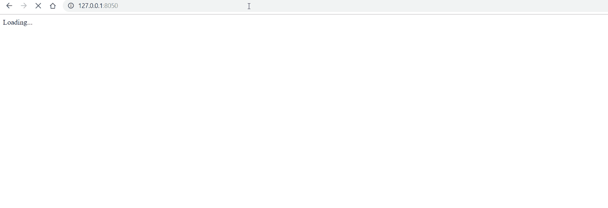

# dash-editor-components

Python code editor with syntax highlighting in [Plotly Dash][dash-homepage]! 

*dash-editor-components* relies on [react simple code editor][react-simple-editor] and [prismJS][prism].

## Installation

### PyPI

You can install *dash-editor-components* with `pip`:

```
pip install dash-editor-components
```

## Motivation
*dash-editor-components* was created by [Quantee][quantee-homepage], a company providing statistical and data science solutions in the insurance sector.
In one of the apps that we provide for our insurance clients, we have created a module to tweak existing machine learning models by editing Python code.
This is a by-product of this project and we share it with the community!

## Example

Just include *PythonEditor* component in your app and you are ready to go!

```
import dash_editor_components
import dash
import dash_html_components as html


app = dash.Dash(__name__)

app.layout = html.Div([
    dash_editor_components.PythonEditor(
        id='input'
    )
])

if __name__ == '__main__':
    app.run_server(debug=True)
```


## FAQ

- How can I change the font size?

Just include ```style={'fontSize': your_value}``` property, where ```your_value``` is for example '16px'.
- Is it possible to use other prism themes? 

*dash-editor-components* comes with preloaded css for styling, however you can change container__editor and token css with your own stylesheet.
- How to access current code in PythonEditor in Dash callback?

Just write Dash callback with ```Input(your_id, 'value')``` or ```State(your_id, 'value')```, where ```your_id``` is ID of PythonEditor component.

## Contributing
This project was generated by the [dash-component-boilerplate](https://github.com/plotly/dash-component-boilerplate) it contains the minimal set of code required to create your own custom Dash component.

[dash-homepage]: https://dash.plot.ly/
[quantee-homepage]: https://quantee.ai
[react-simple-editor]: https://github.com/satya164/react-simple-code-editor
[prism]: https://prismjs.com/
